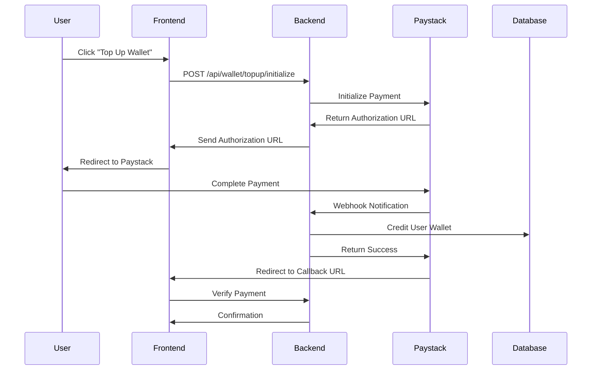
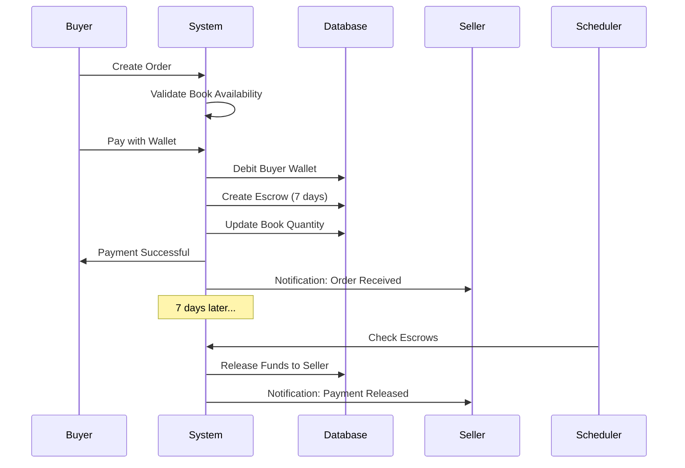

# Wallet & Escrow System Documentation

## Overview

The Kitabu Connect platform implements a comprehensive wallet and escrow system similar to Upwork and Fiverr, ensuring secure transactions between buyers and sellers of textbooks. This document provides a complete guide to understanding and using the system.

## Table of Contents

1. [System Architecture](#system-architecture)
2. [Database Schema](#database-schema)
3. [Services](#services)
4. [API Endpoints](#api-endpoints)
5. [Payment Flow](#payment-flow)
6. [Escrow Process](#escrow-process)
7. [Environment Setup](#environment-setup)
8. [Usage Examples](#usage-examples)

---

## System Architecture

### Key Components

1. **Wallet Service** - Manages user wallet balances and transactions
2. **Escrow Service** - Handles fund holding and release (7-day hold period)
3. **Order Service** - Manages the complete purchase workflow
4. **Payment Service** - Integrates with Paystack for payment processing
5. **Escrow Release Scheduler** - Automatically releases funds after 7 days

### Transaction Flow

```
User Top-Up → Paystack → Wallet Credit → Purchase → Escrow Hold (7 days) → Auto Release to Seller
```

---

## Database Schema

### 1. Transactions Table
Stores all financial transactions in the system.

**Fields:**
- `id` - Unique transaction identifier
- `user_id` - User who initiated the transaction
- `type` - Transaction type: `topup`, `withdrawal`, `purchase`, `sale`, `refund`, `escrow_hold`, `escrow_release`
- `status` - Status: `pending`, `processing`, `completed`, `failed`, `cancelled`
- `amount` - Transaction amount
- `currency` - Currency code (default: KES)
- `payment_method` - Payment method used
- `payment_reference` - External payment reference (e.g., Paystack reference)
- `book_listing_id` - Related book listing (if applicable)
- `escrow_id` - Related escrow account (if applicable)
- `description` - Human-readable description
- `metadata` - JSON string for additional data
- `created_at` - Transaction creation timestamp
- `completed_at` - Transaction completion timestamp

### 2. Escrow Accounts Table
Manages funds held in escrow.

**Fields:**
- `id` - Unique escrow identifier
- `book_listing_id` - Book being sold
- `buyer_id` - Buyer user ID
- `seller_id` - Seller user ID
- `amount` - Total amount held in escrow
- `platform_fee` - Platform fee (5% of amount)
- `status` - Status: `pending`, `active`, `released`, `refunded`, `disputed`
- `hold_period_days` - Number of days to hold (default: 7)
- `release_at` - Scheduled release date
- `released_at` - Actual release date
- `refunded_at` - Refund date (if refunded)
- `dispute_reason` - Reason for dispute (if disputed)
- `dispute_resolved_at` - Dispute resolution date
- `notes` - Additional notes
- `created_at`, `updated_at` - Timestamps

### 3. Wallet Transactions Table
Detailed ledger of all wallet balance changes.

**Fields:**
- `id` - Unique ledger entry ID
- `user_id` - User whose wallet was affected
- `type` - `debit` or `credit`
- `amount` - Amount of change
- `balance_after` - Wallet balance after this transaction
- `transaction_id` - Reference to main transaction
- `description` - Description of the change
- `created_at` - Timestamp

### 4. Orders Table
Manages book purchase orders.

**Fields:**
- `id` - Unique order ID
- `order_number` - Human-readable order number
- `buyer_id`, `seller_id` - Buyer and seller user IDs
- `book_listing_id` - Book being purchased
- `quantity` - Number of books
- `total_amount` - Total order amount
- `platform_fee` - Platform fee
- `seller_amount` - Amount seller will receive
- `status` - Status: `pending`, `paid`, `confirmed`, `in_transit`, `delivered`, `completed`, `cancelled`, `refunded`
- `escrow_id` - Related escrow account
- `delivery_method`, `delivery_address` - Delivery information
- `tracking_number` - Shipping tracking number
- `paid_at`, `confirmed_at`, `delivered_at`, `completed_at`, `cancelled_at` - Status timestamps
- `buyer_notes`, `seller_notes` - User notes
- `cancellation_reason` - Reason for cancellation
- `created_at`, `updated_at` - Timestamps

---

## Services

### Wallet Service ([server/services/wallet.service.ts](server/services/wallet.service.ts))

**Methods:**
- `getBalance(userId)` - Get user's current wallet balance
- `creditWallet(params)` - Add funds to wallet
- `debitWallet(params)` - Remove funds from wallet
- `getTransactionHistory(userId, limit)` - Get wallet transaction history
- `getAllTransactions(userId, limit)` - Get all user transactions
- `createTransaction(params)` - Create a transaction record
- `updateTransactionStatus(transactionId, status)` - Update transaction status

### Escrow Service ([server/services/escrow.service.ts](server/services/escrow.service.ts))

**Methods:**
- `createEscrow(params)` - Create new escrow account
- `releaseEscrow(escrowId)` - Release funds to seller
- `refundEscrow(escrowId, reason)` - Refund funds to buyer
- `createDispute(escrowId, reason)` - Create a dispute
- `getEscrowsReadyForRelease()` - Get escrows ready for automatic release
- `processAutomaticReleases()` - Process all pending releases
- `getUserEscrows(userId, role)` - Get user's escrow accounts

**Platform Fee:** 5% of transaction amount

### Order Service ([server/services/order.service.ts](server/services/order.service.ts))

**Methods:**
- `createOrder(params)` - Create a new order
- `processPayment(orderId, buyerId)` - Process payment using wallet balance
- `updateOrderStatus(orderId, userId, status, updates)` - Update order status
- `getUserOrders(userId, role)` - Get user's orders
- `getOrderById(orderId, userId)` - Get specific order details

### Payment Service ([server/services/payment.service.ts](server/services/payment.service.ts))

**Methods:**
- `initializeWalletTopUp(params)` - Initialize Paystack payment for top-up
- `verifyPaymentAndCreditWallet(reference)` - Verify payment and credit wallet
- `handlePaystackWebhook(event)` - Handle Paystack webhook events

---

## API Endpoints

### Wallet Endpoints

#### Get Wallet Balance
```http
GET /api/wallet/balance
Authorization: Required (Cookie: auth_token)
```

**Response:**
```json
{
  "success": true,
  "balance": 5000.00,
  "currency": "KES"
}
```

#### Get Transaction History
```http
GET /api/wallet/transactions?limit=50
Authorization: Required
```

**Response:**
```json
{
  "success": true,
  "transactions": [
    {
      "id": 1,
      "type": "credit",
      "amount": "1000.00",
      "balanceAfter": "5000.00",
      "description": "Wallet top-up via Paystack",
      "createdAt": "2025-12-20T10:30:00.000Z"
    }
  ]
}
```

#### Initialize Wallet Top-Up
```http
POST /api/wallet/topup/initialize
Authorization: Required
Content-Type: application/json

{
  "amount": 1000,
  "email": "user@example.com"
}
```

**Response:**
```json
{
  "success": true,
  "authorizationUrl": "https://checkout.paystack.com/...",
  "reference": "KITABU-1234567890-123456"
}
```

#### Verify Payment
```http
GET /api/wallet/topup/verify/:reference
Authorization: Required
```

**Response:**
```json
{
  "success": true,
  "amount": 1000,
  "message": "Wallet topped up successfully"
}
```

### Order Endpoints

#### Create Order
```http
POST /api/wallet/orders
Authorization: Required
Content-Type: application/json

{
  "bookListingId": 1,
  "quantity": 1,
  "deliveryMethod": "pickup",
  "deliveryAddress": "Nairobi, Kenya",
  "buyerNotes": "Please contact me before delivery"
}
```

**Response:**
```json
{
  "success": true,
  "orderId": 1,
  "order": {
    "id": 1,
    "orderNumber": "ORD-1234567890-1234",
    "totalAmount": "500.00",
    "status": "pending"
  }
}
```

#### Pay for Order
```http
POST /api/wallet/orders/:orderId/pay
Authorization: Required
```

**Response:**
```json
{
  "success": true,
  "message": "Payment successful. Funds held in escrow for 7 days."
}
```

#### Update Order Status
```http
PUT /api/wallet/orders/:orderId/status
Authorization: Required
Content-Type: application/json

{
  "status": "confirmed",
  "trackingNumber": "TRK123456789",
  "notes": "Package shipped"
}
```

#### Get User Orders
```http
GET /api/wallet/orders?role=buyer
Authorization: Required
```

### Escrow Endpoints

#### Get User Escrows
```http
GET /api/wallet/escrow?role=buyer
Authorization: Required
```

**Response:**
```json
{
  "success": true,
  "escrows": [
    {
      "id": 1,
      "amount": "500.00",
      "status": "active",
      "releaseAt": "2025-12-27T10:30:00.000Z",
      "bookListingId": 1
    }
  ]
}
```

#### Create Dispute
```http
POST /api/wallet/escrow/dispute
Authorization: Required
Content-Type: application/json

{
  "escrowId": 1,
  "reason": "Book received was in poor condition, not as described"
}
```

---

## Payment Flow

### 1. Wallet Top-Up Flow



### 2. Purchase Flow



---

## Escrow Process

### Escrow Lifecycle

1. **Creation** (`active`)
   - Funds debited from buyer's wallet
   - Escrow account created with 7-day hold period
   - `releaseAt` = `createdAt` + 7 days

2. **Holding Period** (7 days)
   - Funds held securely
   - Buyer can raise disputes
   - Seller prepares and ships the book

3. **Automatic Release** (`released`)
   - After 7 days, cron job automatically releases funds
   - Platform fee (5%) deducted
   - Remaining amount credited to seller's wallet
   - Order status updated to `completed`

4. **Alternative Outcomes**
   - **Refund** (`refunded`): If order cancelled or dispute resolved in favor of buyer
   - **Dispute** (`disputed`): If buyer raises concerns, manual review required

### Dispute Resolution

When a buyer creates a dispute:
1. Escrow status changes to `disputed`
2. Automatic release is paused
3. Platform admin reviews the case
4. Admin can manually trigger `releaseEscrow()` or `refundEscrow()`

---

## Environment Setup

### 1. Install Dependencies
```bash
npm install
```

### 2. Configure Environment Variables
Create a `.env` file based on `.env.example`:

```env
# Paystack Configuration
PAYSTACK_SECRET_KEY=sk_test_your_secret_key_here
PAYSTACK_PUBLIC_KEY=pk_test_your_public_key_here

# Frontend URL
FRONTEND_URL=http://localhost:5000
```

### 3. Get Paystack Credentials

1. Sign up at [https://paystack.com](https://paystack.com)
2. Go to **Dashboard > Settings > API Keys & Webhooks**
3. Copy your **Secret Key** and **Public Key**
4. Add webhook URL: `https://your-domain.com/api/webhooks/paystack`

### 4. Run Database Migration
```bash
# Apply the wallet and escrow migration
mysql -u root -p kitabu_connect < migrations/0004_create_wallet_escrow_system.sql
```

### 5. Start the Server
```bash
npm run dev
```

The escrow release scheduler will start automatically and run every hour.

---

## Usage Examples

### Example 1: User Tops Up Wallet

```javascript
// Frontend: Initialize top-up
const response = await fetch('/api/wallet/topup/initialize', {
  method: 'POST',
  headers: { 'Content-Type': 'application/json' },
  credentials: 'include',
  body: JSON.stringify({
    amount: 1000,
    email: 'user@example.com'
  })
});

const { authorizationUrl, reference } = await response.json();

// Redirect user to Paystack
window.location.href = authorizationUrl;

// After payment, Paystack redirects to /wallet/verify
// Frontend: Verify payment
const verifyResponse = await fetch(`/api/wallet/topup/verify/${reference}`, {
  credentials: 'include'
});

const result = await verifyResponse.json();
console.log(result.message); // "Wallet topped up successfully"
```

### Example 2: User Purchases a Book

```javascript
// Step 1: Create order
const orderResponse = await fetch('/api/wallet/orders', {
  method: 'POST',
  headers: { 'Content-Type': 'application/json' },
  credentials: 'include',
  body: JSON.stringify({
    bookListingId: 42,
    quantity: 1,
    deliveryMethod: 'delivery',
    deliveryAddress: 'Nairobi, Kenya'
  })
});

const { orderId } = await orderResponse.json();

// Step 2: Pay for order with wallet
const paymentResponse = await fetch(`/api/wallet/orders/${orderId}/pay`, {
  method: 'POST',
  credentials: 'include'
});

const result = await paymentResponse.json();
console.log(result.message); // "Payment successful. Funds held in escrow for 7 days."
```

### Example 3: Seller Confirms Shipment

```javascript
const response = await fetch(`/api/wallet/orders/${orderId}/status`, {
  method: 'PUT',
  headers: { 'Content-Type': 'application/json' },
  credentials: 'include',
  body: JSON.stringify({
    status: 'in_transit',
    trackingNumber: 'TRK123456789',
    notes: 'Shipped via DHL'
  })
});
```

### Example 4: Buyer Creates Dispute

```javascript
const response = await fetch('/api/wallet/escrow/dispute', {
  method: 'POST',
  headers: { 'Content-Type': 'application/json' },
  credentials: 'include',
  body: JSON.stringify({
    escrowId: 1,
    reason: 'Book condition does not match description. Pages are torn and cover is damaged.'
  })
});

const result = await response.json();
console.log(result.message); // "Dispute created successfully. Our team will review it shortly."
```

---

## Security Best Practices

1. **Webhook Verification**: Implement Paystack webhook signature verification in production
2. **Rate Limiting**: Add rate limiting to payment endpoints
3. **Input Validation**: All inputs are validated using Zod schemas
4. **Transaction Integrity**: All wallet operations use database transactions
5. **Audit Trail**: Complete transaction history maintained
6. **Escrow Protection**: Funds held securely, automatic release after 7 days
7. **Dispute Mechanism**: Manual review process for disputed transactions

---

## Troubleshooting

### Issue: Wallet not credited after payment

**Solution:**
1. Check Paystack webhook logs
2. Verify payment reference in database
3. Check transaction status in `transactions` table
4. Manually trigger: `paymentService.verifyPaymentAndCreditWallet(reference)`

### Issue: Escrow not releasing automatically

**Solution:**
1. Check if escrow release scheduler is running
2. Verify `release_at` timestamp is in the past
3. Check escrow `status` is `active`
4. Manually trigger: `escrowService.processAutomaticReleases()`

### Issue: Payment initialization fails

**Solution:**
1. Verify `PAYSTACK_SECRET_KEY` is set correctly
2. Check Paystack API status
3. Verify amount is within limits (10 - 1,000,000 KES)
4. Check user email is valid

---

## Testing

### Test Paystack Integration

Use Paystack test cards:
- **Success**: 4084 0840 8408 4081 (CVV: 408, Expiry: any future date)
- **Failure**: 4084 0840 8408 4084

### Manual Escrow Release

```javascript
// In server console or create an admin endpoint
import { escrowService } from './services/escrow.service';

// Release specific escrow
await escrowService.releaseEscrow(escrowId);

// Process all pending releases
await escrowService.processAutomaticReleases();
```

---

## Future Enhancements

1. **Withdrawal System**: Allow users to withdraw funds to M-Pesa/Bank
2. **Multi-currency Support**: Support USD, EUR, etc.
3. **Partial Refunds**: Support partial refunds for disputes
4. **Escrow Extensions**: Allow extending hold period
5. **Admin Dashboard**: UI for managing disputes and escrows
6. **Notifications**: Email/SMS notifications for escrow events
7. **Analytics**: Transaction analytics and reporting

---

## Support

For issues or questions:
- GitHub Issues: [https://github.com/your-repo/issues](https://github.com/your-repo/issues)
- Email: support@kitabuconnect.com

---

**Last Updated:** December 20, 2025
**Version:** 1.0.0
